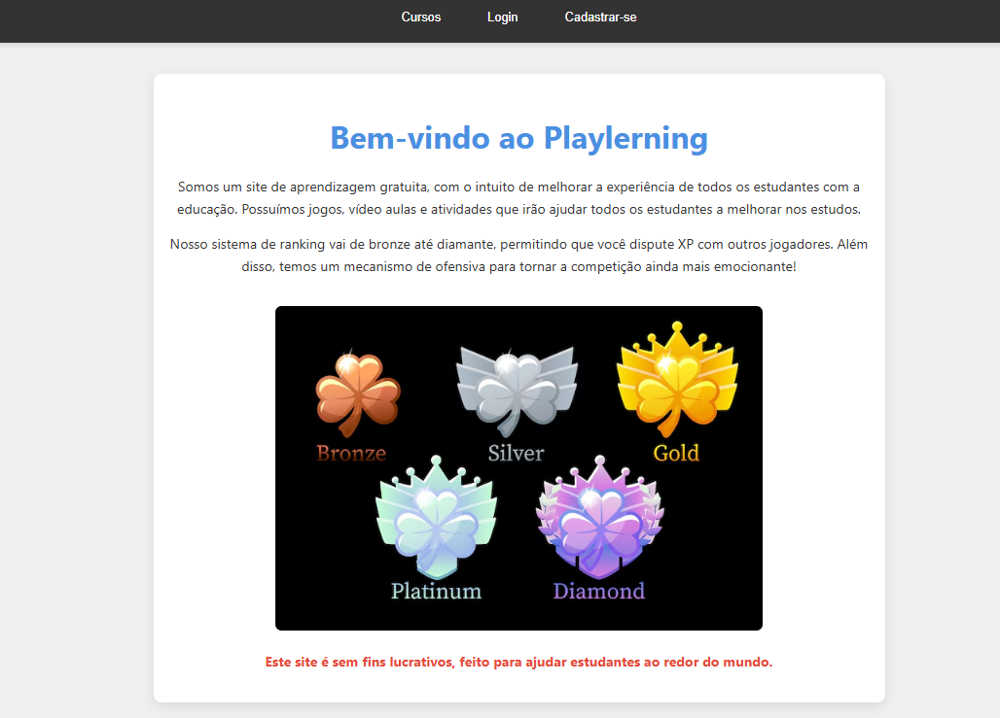

<h1 align="center">
  
   <strong>Playlerning</strong>
</h1>

  🌟 Uma plataforma de estudos gamificada e interativa! Aprenda, evolua, ganhe XP e exiba suas conquistas! 🚀

  

<h2>🚀 Tecnologias Utilizadas</h2>

  
  
  
  

<ul>
  <li><strong>HTML5, CSS3 e JavaScript</strong> – Estrutura e interatividade do front-end</li>
  <li><strong>Python + Flask + Flask_SQLAlchemy</strong> – Backend moderno e escalável</li>
  <li><strong>SQL</strong> – Gerenciamento de banco de dados e progresso do usuário</li>
</ul>

<h2>📂 Estrutura do Projeto</h2>

<pre>
📁 public
 ┣ 📂 images        # Imagens públicas (ícones, banners, ilustrações)
 ┣ 📂 fonts         # Fontes customizadas
 ┗ 📂 ...           # Arquivos CSS, JS etc.

📁 src
 ┣ 📂 models        # Modelos ORM com SQLAlchemy
 ┣ 📂 routes        # Rotas e lógicas de servidor (Flask)
 ┣ 📂 templates     # Páginas HTML com Jinja2
 ┗ 📂 ...           # Backend e lógica principal
</pre>

<h2>📘 Como Funciona a Plataforma</h2>

<ul>
  <li>🎮 <strong>Dois modos de estudo:</strong> ENEM e Informática</li>
  <li>📖 <strong>Disciplinas com livros digitais e questionários</strong></li>
  <li>📚 <strong>5 Unidades por disciplina</strong>, cada uma com:
    <ul>
      <li>1 Livro teórico</li>
      <li>5 Seções com 10 questões cada</li>
    </ul>
  </li>
  <li>🏆 <strong>Ranks:</strong> Bronze → Prata → Ouro → Platina → Diamante</li>
  <li>🧠 <strong>Sistema de XP:</strong> acertos rendem pontos e evoluções</li>
  <li>❌ <strong>Reprovação:</strong> menos de 50% = refazer a seção</li>
</ul>

  

<h2>🧩 Recursos Extras</h2>

<ul>
  <li>💬 <strong>Fórum interativo:</strong> Tire dúvidas, responda colegas e exiba insígnias</li>
  <li>🎯 <strong>Missões:</strong> como jogar por 10 dias seguidos ou ganhar XP específico</li>
  <li>👨‍🏫 <strong>Modo Professor:</strong>
    <ul>
      <li>Criação de livros e atividades</li>
      <li>Interação no fórum</li>
      <li>Cadastro mediante envio de currículo</li>
    </ul>
  </li>
  <li>🔒 <strong>Moderação:</strong> Termos de uso e políticas de privacidade respeitados</li>
</ul>

<h2>📸 Ilustração da Plataforma</h2>

  

<h2>📎 Contato e Contribuição</h2>

  Sinta-se à vontade para abrir <strong>issues</strong>, sugerir melhorias ou contribuir com código! Esta plataforma está em constante evolução para oferecer uma experiência de aprendizado cada vez mais divertida e eficaz. 🎓✨

    
  <strong>Feito com ❤️ por uma mente apaixonada por ensino e tecnologia.</strong>

